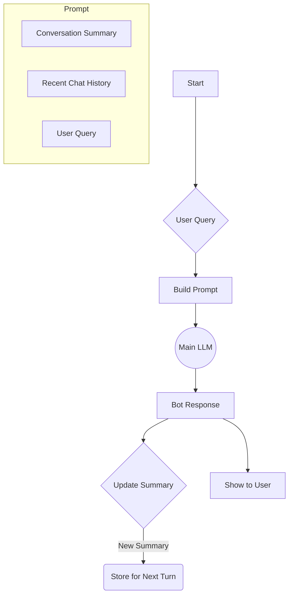

# **Module 4, Lesson 1: Mastering the Context Window**

### Building on What We've Learned

We know how to build a RAG pipeline that puts relevant information into the context window. But the context window is like a computer's RAM—it's finite, and how you organize information within it drastically affects performance. This lesson is about using that "working memory" effectively.

### Learning Objectives

By the end of this lesson, you will be able to:
*   **Explain** the "Needle in a Haystack" problem and its implications for prompt design.
*   **Structure** a prompt to place the most critical information at the beginning and end.
*   **Compare and contrast** different strategies for managing long conversations (Sliding Window vs. Summarization Memory).
*   **Design** a conceptual "Summarization Memory" loop for a chatbot.

---

### **1. The "Needle in a Haystack" Problem**

A groundbreaking study by Google highlighted a critical challenge with large context windows. Researchers "hid" a single, relevant piece of information (the "needle") at various depths within a large, irrelevant body of text (the "haystack") and tested a model's ability to find it.

**The Findings:**
*   **Performance Degrades in the Middle:** Models are very good at recalling information placed at the very **beginning** or very **end** of the context window. Their performance drops significantly when key information is buried in the **middle**.
*   **Bigger Isn't Always Better:** Increasing the amount of context (a bigger haystack) often made it even harder for the model to find the needle.

> **What this means for Context Engineering:**
> You cannot simply dump dozens of retrieved documents into the context window and hope for the best. **The order in which you place information matters.**

**Practical Strategy: Re-order for Importance**
A simple but effective strategy is to sandwich your "haystack" between your most important "needles."

1.  **Beginning of Prompt:** Start with your most critical instructions (e.g., system prompt, persona, rules).
2.  **Middle of Prompt:** Place the less-structured, dense, or lower-priority information (e.g., the full text of retrieved documents, a long chat history).
3.  **End of Prompt:** Reiterate the most important instruction or the user's immediate question right at the very end.

By placing the query at the end, you refocus the model's attention on its specific task right after it has processed all the context.

---

### **2. Strategies for Managing Long Conversations**

In a chatbot setting, the context window fills up not just with retrieved documents, but with the conversation history itself. We need strategies to manage this "memory" to prevent costs from spiraling and to stop the bot from "forgetting" early parts of the conversation.

**A. Sliding Window Memory:**
*   **Method:** The simplest approach. It keeps only the last `K` turns of the conversation (e.g., the 10 most recent messages).
*   **Pro:** Easy to implement.
*   **Con:** The bot will abruptly "forget" anything said more than `K` turns ago, even if it was important, like the user's name or goal.

**B. Summarization Memory:**
*   **Method:** A more sophisticated approach. As the conversation grows, you periodically use a separate, cheaper LLM call to create a running summary of the conversation.
*   **Pro:** Allows the bot to "remember" key facts from much earlier in the conversation without keeping the full transcript.
*   **Con:** A poor summary can cause the bot to misremember details. This also adds latency and cost.

**Diagram: A Summarization Memory Loop**

In this loop, the context sent to the main LLM is a combination of the long-term summary and the short-term chat history. After each turn, the summary is updated.

---

### **Key Takeaways**

*   Models are best at recalling information from the **beginning and end** of the context window.
*   Structure your prompts to put critical instructions at the start and the final, specific question at the end.
*   For long conversations, you must have a strategy like **Sliding Window** or **Summarization Memory** to manage the chat history.
*   **Summarization Memory** provides a better long-term "memory" at the cost of added complexity and latency.

### **Hands-On Task: Design a Memory Strategy**

You are designing a chatbot with a specific persona. For each scenario below, decide which memory strategy would be more appropriate: **Sliding Window** or **Summarization**. Explain your reasoning.

1.  **Scenario A: The "Sarcastic Buddy" Bot**
    *   **Persona:** A bot that makes witty, sarcastic comments about the ongoing conversation. Its main goal is entertainment. It doesn't need to remember the user's name or complex facts, but it absolutely needs to know the last one or two things that were said to make relevant jokes.

2.  **Scenario B: The "Project Manager" Bot**
    *   **Persona:** A bot designed to help a user plan a complex project over a long conversation. It needs to remember the project's name, key deadlines discussed 30 minutes ago, a list of stakeholders, and the user's budget, and synthesize this information to answer new questions.

3.  **Scenario C: The "Live Sports Ticker" Bot**
    *   **Persona:** A bot that gives real-time updates on a sports game. Users ask "What was that last play?" or "Who just scored?". The bot only needs to know what has happened in the last 2-3 minutes of the game. Information from the first half of the game is irrelevant to the immediate action. 