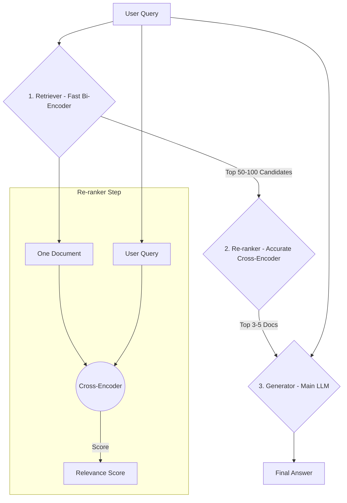

# **Module 4, Lesson 3: Re-ranking for Relevance**

### Building on What We've Learned

We've learned how to retrieve documents and compress them. Re-ranking is a final, powerful optimization step we can take to ensure the documents we feed to our Generator are the absolute best, most relevant ones available.

### Learning Objectives

By the end of this lesson, you will be able to:
*   **Explain** the purpose of a re-ranker in a RAG pipeline.
*   **Differentiate** between a bi-encoder (for retrieval) and a cross-encoder (for re-ranking).
*   **Diagram** a RAG pipeline that includes a re-ranking step.
*   **Apply** metadata filtering to a retrieved set of documents.
*   **Describe** how contrastive training techniques like Focused Transformer (FoT) can improve retrieval quality.

---

### **1. The Problem: "Good Enough" vs. "The Best"**

The retrieval models we use in our vector databases are called **bi-encoders**. They are designed for one thing: **speed**. They create vector embeddings for the query and documents *independently* and then just compare the vectors. This is fast enough to search millions of documents, but it's not always perfectly accurate. It's a "good enough" first pass.

A **cross-encoder** is a different type of model designed for **accuracy**.
*   **How it Works:** It takes both the user's query and a single document *together* as one combined input. It can then perform a much deeper, token-by-token analysis of the relationship between them.
*   **The Catch:** This deep analysis is much, much slower. You could never use a cross-encoder to search your whole database.

This is why we use a multi-stage process: use the fast bi-encoder to find the "haystack" and the slow, accurate cross-encoder to find the "needle."

**Diagram: The Re-ranking Pipeline**

**The Workflow:**
1.  **Retrieve (Fast & Broad):** Use your vector database to retrieve a large set of candidate documents (e.g., the top 50).
2.  **Re-rank (Slow & Accurate):** For each of those 50 documents, use a cross-encoder to get a highly precise relevance score.
3.  **Select:** Take the top K (e.g., top 3-5) documents from the re-ranked list. These are now the highest quality, most relevant documents to pass to your Generator LLM.

This hybrid approach gives you the best of both worlds: the speed of vector search and the accuracy of a cross-encoder.

---

### **2. Filtering by Metadata**

Sometimes, relevance isn't just about the *content* of a document, but its *metadata*—like its creation date, source, or author. Most vector databases allow you to store this metadata alongside your vectors. You can then use this metadata to filter your results after the retrieval step.

**Example Use Case:**
*   **User Asks:** "What were our Q1 earnings?"
*   **Retriever Finds:** Documents about Q1 earnings from 2024, 2023, and 2022.
*   **You Assume:** The user probably wants the most recent information.
*   **Filter Step:** Before re-ranking, you can programmatically filter out any documents where `year != 2024`.

This is a powerful way to add business logic to your RAG pipeline, making the final output even more reliable and tailored to the user's implicit needs.

---

### **3. Emerging Technique: Improving the Embeddings Themselves**

Re-ranking and filtering help us select the best documents *after* they have been retrieved. But what if we could improve the quality of the initial retrieval itself? A new area of research focuses on improving the vector embeddings to make them less "distractible."

**The Distraction Issue:**
When you have a massive knowledge base, it's possible for the vector representations of two different concepts to be very similar, even if they aren't semantically related in a way that's useful for the query. This can cause the retriever to pull in irrelevant documents, creating noise.

**Focused Transformer (FoT): A Contrastive Training Approach**
*   **The Idea:** The **Focused Transformer (FoT)** is a technique that fine-tunes a model using an approach inspired by **contrastive training**.
*   **How it Works:** During training, the model is explicitly taught to pull the embeddings of *truly relevant* documents closer to the query's embedding, while simultaneously pushing the embeddings of *irrelevant* or "distractor" documents further away.
*   **The Result:** This creates a more distinct and well-structured embedding space. The model gets better at distinguishing between the "needle" and other pieces of "hay" that just look like needles, leading to a higher-quality set of documents in the very first retrieval step.

While re-ranking is a post-processing step to refine results, techniques like FoT are a pre-processing step to improve the fundamental quality of the vector space itself. A state-of-the-art pipeline might use both.

---

### **Key Takeaways**

*   **Re-ranking** is an optional but powerful step that uses a slower, more accurate model (a **cross-encoder**) to re-order the initial results from your vector database.
*   The standard RAG pipeline is: **Retrieve (fast) -> Re-rank (accurate) -> Generate.**
*   You can also use **metadata filtering** after retrieval to narrow down results based on criteria like date or source, adding another layer of logic to your system.
*   Emerging techniques like **Focused Transformer (FoT)** use contrastive training to improve the quality of the embeddings themselves, making the initial retrieval more robust to "distractor" documents.

### **Hands-On Task: Design the Final Pipeline**

**Scenario:**
You are building the "ultimate" RAG pipeline for a financial services company. It needs to be as accurate as possible and handle complex user queries.

**Your Task:**
Draw a diagram (using Mermaid if you can, or just text) that shows the complete flow of a user query through the following components. Connect them with arrows to show the sequence.

**Components to include:**
1.  User Query
2.  Retriever (Vector DB)
3.  Metadata Filter (Keep only documents from the last 12 months)
4.  Re-ranker (Cross-Encoder)
5.  Contextual Compressor
6.  Generator (Main LLM)
7.  Final Answer

This exercise will challenge you to assemble everything you've learned in Modules 3 and 4 into a single, state-of-the-art RAG architecture. 
