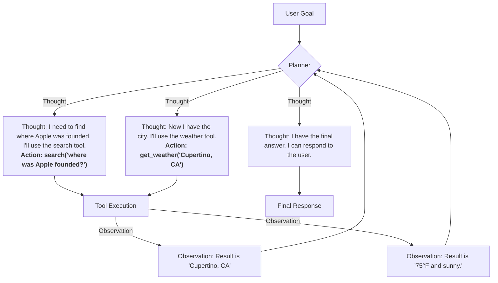

# **Module 5, Lesson 1: The Rise of AI Agents**

### Building on What We've Learned

Welcome to Module 5. So far, we've built systems that can answer questions based on provided information (RAG). We are now moving beyond just *answering* and into the realm of *acting*. An **AI Agent** is a system that uses an LLM not just to generate text, but to make decisions, use tools, and take actions to achieve a goal.

### Learning Objectives

By the end of this lesson, you will be able to:
*   **Define** an AI Agent and differentiate it from a RAG system.
*   **List and describe** the three core components of an agent: the Planner, the Tools, and the Memory.
*   **Diagram** the cyclical "ReAct" (Reasoning + Acting) loop that agents follow.

---

### **1. The Agentic Mindset: From Answering to Doing**

A RAG system is like an "open-book" research assistant. You ask a question, and it finds the answer in its books.

An **agent** is a personal assistant you can give a goal to. It not only reads the books but can also use a phone, a calculator, or a calendar to get the job done.

The agent follows a dynamic, cyclical path: **Goal -> Think -> Act -> Observe -> Think -> Act ...** until the goal is complete.

The **agentic mindset** is about giving the AI:
1.  A **Goal** to achieve (e.g., "Book a flight from New York to London for next Tuesday").
2.  A set of **Tools** it can use (e.g., a flight search API, a calendar API).
3.  The **Autonomy** to decide which tools to use, in what order, and with what inputs, to achieve the goal.

---

### **2. The Core Components of an Agent**

**A. The Planner (The "Brain")**
The core LLM. Its job is to reason about the user's goal and create a plan. It is responsible for:
*   **Decomposition:** Breaking a complex goal ("Plan my weekend trip") into smaller steps ("1. Find hotels. 2. Check weather.").
*   **Tool Selection:** Deciding which available tool is right for the current step.
*   **Reasoning:** Analyzing the results of tool calls ("Observations") to decide what to do next.

**B. The Tools (The "Hands")**
A set of functions or APIs that the agent can call to interact with the world. The agent *cannot* perform actions directly; it can only invoke the tools you give it.
*   `search_flights(origin, destination, date)`
*   `send_email(recipient, subject, body)`
*   Even your RAG retriever is a tool! `search_knowledge_base(query)`

**C. The Memory (The "Scratchpad")**
The context that persists between steps. It stores:
*   The user's original goal.
*   The multi-step plan.
*   The results of previous tool calls (Observations), which are crucial for the next step of the plan.

---

### **3. The Agentic Loop: ReAct (Reason + Act)**

One of the most common agentic frameworks is called **ReAct**. It formalizes the "Think, Act, Observe" cycle.

**Diagram: A ReAct Loop in Action**
*   **Goal:** "What's the weather in the city where Apple was founded?"

This loop continues until the Planner decides it has enough information to satisfy the user's original goal. In the next lesson, we'll dive deep into the most important part of this system: designing and describing the tools so the agent can use them effectively.

---

### **Key Takeaways**

*   An **AI Agent** uses an LLM to reason, plan, and use tools to achieve a goal.
*   The core components are the **Planner** (brain), **Tools** (hands), and **Memory** (scratchpad).
*   The **ReAct** framework guides the agent through a cycle of **Thought -> Action -> Observation** until the goal is met.

### **Hands-On Task: Agent or Not?**

For each of the following scenarios, decide if you would need a simple RAG system or a more complex AI Agent to solve the problem. Explain your reasoning.

1.  **Scenario A:** A user asks, "What is the capital of France?" You have a knowledge base of world facts.

2.  **Scenario B:** A user says, "Send an email to my team to remind them about the 3 PM meeting today, and add a weather forecast for our city to the email."

3.  **Scenario C:** A user asks, "Summarize the attached meeting transcript." 
