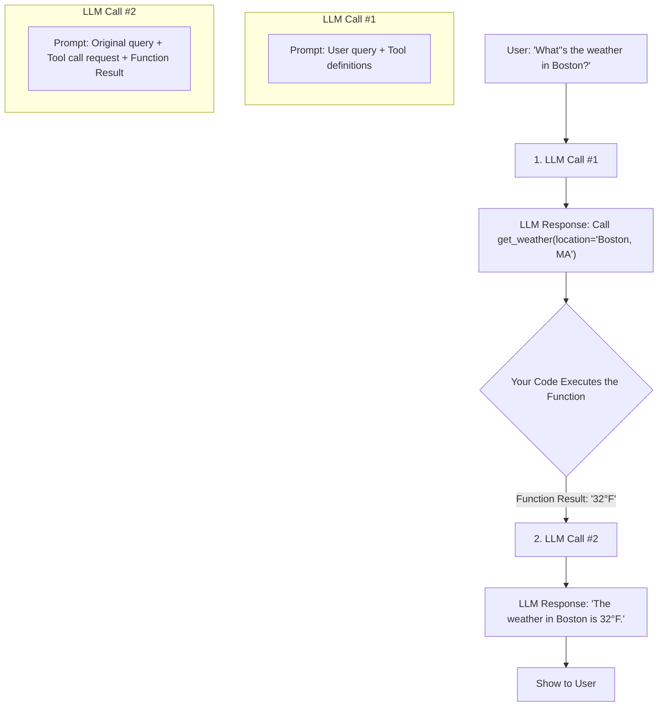

# **Module 5, Lesson 2: Designing and Integrating Tools (Function Calling)**

### Building on What We've Learned

An agent is only as capable as its tools. **Function Calling** is the mechanism that allows us to give an agent "hands" by exposing our own code to it. This lets the agent get live data or take actions in the real world.

### Learning Objectives

By the end of this lesson, you will be able to:
*   **Define** "Function Calling" and explain how an LLM uses it.
*   **Write a tool specification** using the JSON Schema format required by modern APIs.
*   **Follow best practices** for writing clear and effective tool descriptions.
*   **Diagram** the two-step execution loop for a function call.

---

### **1. The Core Idea: Describing Your Tools**

The LLM doesn't *actually* execute your code. That would be a massive security risk. Instead, it generates a structured data object (JSON) that says, **"I want to call this function with these arguments."**

Your application code then:
1.  Parses this JSON object.
2.  Executes the corresponding function in your codebase.
3.  Sends the result from your function back to the LLM.

To make this work, you must first describe your tools to the LLM in a format it understands. The quality of your descriptions is a critical part of context engineering.

**A Best-Practice Tool Definition (JSON Schema):**
Let's define a tool `get_weather_forecast(location, unit)`.

```python
# This is the JSON Schema definition of our tool.
tools = [
    {
        "type": "function",
        "function": {
            "name": "get_weather_forecast",
            "description": "Get the current weather forecast for a given location.",
            "parameters": {
                "type": "object",
                "properties": {
                    "location": {
                        "type": "string",
                        "description": "The city and state, e.g., San Francisco, CA",
                    },
                    "unit": {
                        "type": "string",
                        "enum": ["celsius", "fahrenheit"],
                    },
                },
                "required": ["location"],
            },
        },
    }
]
```

> **Anatomy of a Good Description:**
> *   **`name`**: The exact name of the function in your code.
> *   **`description`**: A clear, one-sentence explanation of what the tool *does*. Be specific. "Gets the weather" is bad. "Gets the *current weather forecast* for a *given location*" is good.
> *   **`parameters` `properties`**: An object listing each parameter the function accepts.
> *   **`parameters` `description`**: Crucial for telling the model what the parameter is and, importantly, what *format* to use. The description for `location` helps the model provide a properly formatted string.
> *   **`enum`**: Use this to tell the model that a parameter can only be one of a few specific values.
> *   **`required`**: A list of parameters that are mandatory for the function to work.

---

### **2. The Two-Step Execution Loop**

A function call always involves two distinct calls to the LLM.

**Diagram: The Function Calling Loop**


1.  **First LLM Call (Decide and Request):** You send the user's query and the list of tool definitions to the LLM. The LLM analyzes them and, if it decides a tool is necessary, it responds with a special `tool_calls` object instead of a text message.

2.  **Your Code Executes:** You parse this object, find the function name and arguments, and run your *actual* code (e.g., your Python `get_weather_forecast` function).

3.  **Second LLM Call (Synthesize Answer):** You take the return value from your function (the "observation") and send it *back* to the LLM in a new message. Now that the LLM has the weather data, it can synthesize a final, natural language answer for the user.

This `user -> llm -> tool -> llm -> user` loop is the fundamental pattern for building AI agents that can interact with the outside world.

---

### **Key Takeaways**

*   You don't give an LLM your code; you give it a **detailed description** of your code in JSON Schema format.
*   The quality and specificity of your function and parameter **descriptions** are critical for the model to use the tool correctly.
*   A successful function call is a **two-step process:** the first LLM call decides *to* call the function, and the second LLM call *uses the result* of that function to answer the user.

### **Hands-On Task: Design a Tool Specification**

**Scenario:**
You have a Python function in your e-commerce application:
`search_products(query: str, category: str = None, on_sale_only: bool = False)`

**Your Task:**
Write a complete JSON Schema tool definition for this function.
*   Pay close attention to the `type` of each parameter (`string`, `boolean`, etc.).
*   Write a clear `description` for the function itself and for each parameter.
*   Assume the `query` parameter is `required`, but the others are optional.
*   For the `category` parameter, assume the only valid options are `["electronics", "apparel", "home_goods"]`. Use an `enum` to specify this. 
