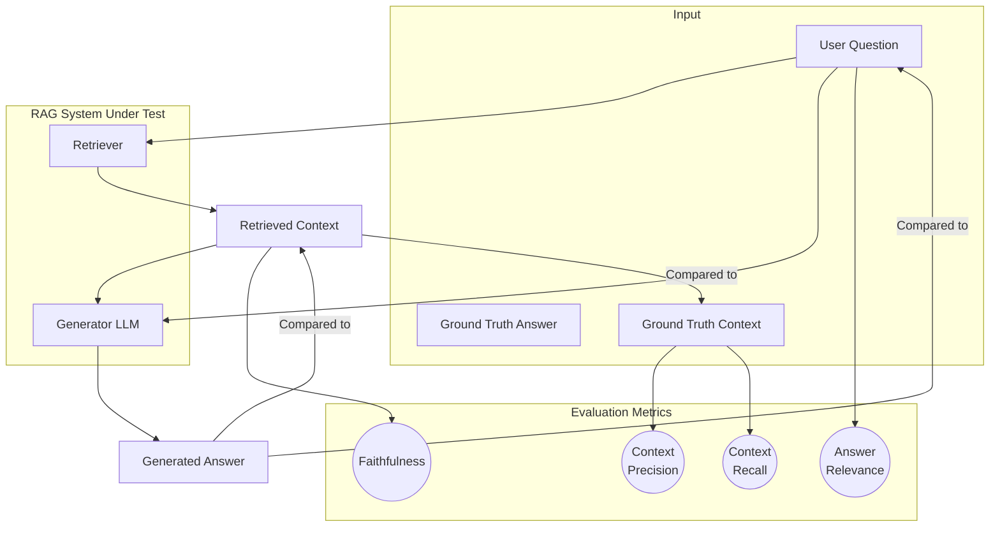

# **Module 6, Lesson 1: Evaluating Context Quality and RAG Performance**

### Building on What We've Learned

Welcome to Module 6. We've focused on *building* systems. Now, we'll focus on *validating* them. How do you know if your RAG system is any good? How can you tell if a change to your prompt made things better or worse? This process is called **RAG-eval**.

### Learning Objectives

By the end of this lesson, you will be able to:
*   **Define** the four key metrics for evaluating a RAG pipeline: Context Precision, Context Recall, Faithfulness, and Answer Relevance.
*   **Explain** the purpose of RAG evaluation frameworks like RAGAs and TruLens.
*   **Describe** the paradigm of "natural language unit testing" with frameworks like LMUnit.
*   **Design** a high-quality item for an evaluation dataset.

---

### **1. The Four Pillars of RAG Evaluation**

We need to evaluate the two main parts of our pipeline separately: "Did I retrieve the right stuff?" (Retrieval) and "Did I generate a good answer from it?" (Generation).

**A. Evaluating the Retriever**

1.  **Context Precision:**
    *   **Question:** Of all the documents I retrieved, how many were actually relevant?
    *   **Why it matters:** Low precision means your retriever is adding "noise" to the context, which increases costs and can confuse the Generator.

2.  **Context Recall:**
    *   **Question:** Of all the relevant documents that *exist* in the knowledge base, did I find them?
    *   **Why it matters:** Low recall means your retriever is failing to find the necessary information, even when it exists. This leads to the model saying "I don't know" when it should have known the answer.

**B. Evaluating the Generator**

3.  **Faithfulness:**
    *   **Question:** Does the final answer stick *only* to the facts provided in the retrieved context?
    *   **Why it matters:** This is a direct measure of **hallucination**. A low faithfulness score means the LLM is making things up.

4.  **Answer Relevance:**
    *   **Question:** Does the final answer actually address the user's original question?
    *   **Why it matters:** It's possible to have a faithful answer that is completely useless. If the answer is factually correct but doesn't answer the *user's specific question*, it has low relevance.

A good RAG system must score well across **all four** of these metrics.

**Diagram: The Evaluation Pipeline**


---

### **2. Automating Evaluation with Frameworks**

Manually checking these metrics is tedious. Frameworks use LLMs as "judges" to automate this process.
*   **RAGAs (RAG Assessment):** A popular framework focused specifically on the four key metrics above.
*   **TruLens:** A more comprehensive framework that not only calculates metrics but also helps you trace the entire execution of your app, so you can see the inputs and outputs of every component.

These frameworks all depend on one critical thing: a good **evaluation dataset**. This is a set of question-answer pairs that represent the kinds of queries you expect from your users.

**Anatomy of a High-Quality Evaluation Item:**
*   `question`: The question to ask the RAG system.
*   `ground_truth_answer`: The ideal, human-written answer.
*   `ground_truth_context`: The specific document chunks that contain the information needed to answer the question. This is required to measure recall.

**Example of a Synthetic Dataset Item:**
```json
{
  "question": "How do I add a new user to my team account?",
  "ground_truth_answer": "To add a new user, you must be an admin. Go to Settings > Team Management, and click the 'Invite User' button.",
  "ground_truth_context": [
    "Admin-level permissions are required to manage team members. The 'Invite User' functionality is located in the Team Management section of the account settings page."
  ]
}
```
Building this dataset is the most labor-intensive part of RAG evaluation, but it is also the most important. Without a high-quality set of test cases, your metrics are meaningless.

---

### **3. A Modern Approach: Natural Language Unit Testing**

While frameworks like RAGAs provide high-level scores across the four pillars, a new, more granular approach is emerging: **natural language unit testing**.

Pioneered by frameworks like **LMUnit**, this paradigm brings the discipline of software engineering to LLM evaluation. Instead of just getting a single score for "Faithfulness," you write a series of clear, pass/fail checks in plain English.

**How it Works:**
An LLM "judge" is given the prompt, the response, and a specific "unit test" to evaluate.

**Example Unit Tests for a Response:**
*   **Global Tests (apply to all responses):**
    *   "Is the response succinct and to the point?"
    *   "Does the response maintain a formal and professional tone?"
    *   "Does the response avoid making up information not present in the context?" (This is a unit test for faithfulness).
*   **Targeted Test (for a specific question):**
    *   Query: "What is the capital of France?"
    *   Unit Test: "Does the response correctly identify Paris as the capital?"

This approach is powerful because it gives you highly specific, actionable feedback. If your application fails the "professional tone" test, you know exactly what to fix in your system prompt. It moves evaluation from a vague, numeric score to a clear, interpretable, and debuggable process.

---

### **Key Takeaways**

*   Evaluating a RAG system requires measuring both the **Retriever** (with Context Precision & Recall) and the **Generator** (with Faithfulness & Answer Relevance).
*   **Faithfulness** is the primary metric for measuring and preventing hallucinations.
*   Frameworks like **RAGAs** automate this evaluation but require a high-quality **evaluation dataset** with ground-truth questions, answers, and contexts.
*   Modern paradigms like **natural language unit testing (LMUnit)** offer a more granular, debuggable, and accessible way to evaluate the specific qualities of an LLM's output.

### **Hands-On Task: Evaluate a RAG System's Output**

**Scenario:**
*   **User Question:** "How do I reset my password?"
*   **Retrieved Context:** `[ "Users can change their password in the 'Security' section of their account settings. Two-factor authentication is required." ]`
*   **Generated Answer:** "To change your password, go to your account settings."

**Your Task:**
Evaluate the generated answer based on the four pillars. Give each a score of **Good**, **Okay**, or **Poor** and justify your rating.
1.  **Context Precision:** (Assume the retrieved context was the *only* one retrieved).
2.  **Context Recall:** (Assume there was another document in the knowledge base: "Password resets can also be initiated from the login screen.").
3.  **Faithfulness:**
4.  **Answer Relevance:** 