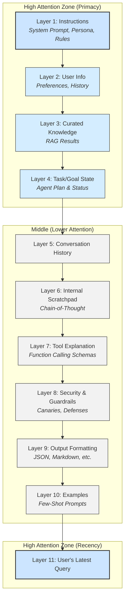

# **Module 7, Lesson 4: A Unifying Theory: Context Window Architecture (CWA)**

### **Building on What We've Learned**

Throughout this course, we have assembled a powerful toolkit of techniques: RAG, ReAct, multi-agent systems, function calling, evaluation, and security. We have treated these as individual components. In this final lesson, we introduce a conceptual framework that organizes these components into a single, coherent engineering discipline: **Context Window Architecture (CWA)**.

### **Learning Objectives**

By the end of this lesson, you will be able to:
*   **Define** Context Window Architecture (CWA) as a standardized blueprint for prompt construction.
*   **Explain** how CWA addresses the core LLM limitations of statelessness and the "lost in the middle" problem.
*   **Map** the key techniques from this course (like RAG and Tool Use) to their corresponding layers in the CWA model.
*   **Appreciate** how a formal architecture elevates "prompt engineering" into a true engineering discipline.

---

### **1. The Problem: From Ad-Hoc Prompts to Engineered Context**

As we've seen, the context window is the operating memory of an LLM. Currently, most applications are built by stitching together various pieces of context—system prompts, user queries, retrieved documents, tool definitions—using simple string concatenation. This ad-hoc approach is brittle, difficult to debug, and doesn't scale.

CWA proposes a solution by treating prompt construction as an architectural design problem. It is a **standardized blueprint** for structuring the information within an LLM's finite context window.

---

### **2. The CWA 11-Layer Model**

CWA defines a stack of 11 distinct, purposeful layers. This layering is strategic and designed to work *with* the LLM's natural biases, not against them.

*   **Primacy Effect:** Foundational, high-level information (Layers 1-4) is placed at the top of the prompt, where the model pays the most attention.
*   **Recency Effect:** The most immediate, task-specific information (Layer 11) is placed at the very bottom, also a high-attention zone.
*   **Mitigating "Lost in the Middle":** This structure ensures that the most critical instructions and the most recent query are in the highest-attention parts of the context window, directly combating performance degradation.

**Diagram: The CWA 11-Layer Stack**

**The Layers and How They Map to This Course:**

| Layer | Name | Purpose & Course Connection |
| :--- | :--- | :--- |
| **1** | **Instructions** | The AI's "constitution"—its persona, goals, and ethical boundaries. This is your master **System Prompt**. |
| **2** | **User Info** | Personalization data, user history, preferences. |
| **3** | **Curated Knowledge** | The **RAG Layer**. Where verified, factual information from your vector database is injected to ground the model. |
| **4** | **Task/Goal State** | Manages multi-step tasks for agents. It holds the current state of a **ReAct** or **Plan-and-Execute** workflow. |
| **5**| **Conversation History**| Provides short-term memory of the immediate dialogue. |
| **6**| **Internal Scratchpad**| Where the model can perform **Chain-of-Thought** reasoning before generating its final output. |
| **7**| **Tool Explanation**| The definitions and schemas for **Function Calling**. Describes what external tools the agent can use. |
| **8**| **Security & Guardrails** | Specific, contextual security instructions, like **"Canary"** phrases to detect prompt injection. |
| **9**| **Output Formatting** | Instructions on how to structure the output (e.g., "Respond in JSON format"). |
| **10**| **Examples**| **Few-Shot Prompting** examples to guide the model's response style and format. |
| **11**| **User's Latest Query** | The immediate question or command from the user that triggers the generation process. |

---

### **3. CWA's Role in the AI Ecosystem**

CWA is not a competing framework; it's an organizational principle that makes other tools more effective.

*   **It Organizes RAG:** RAG is the implementation for **Layer 3**. CWA shows how to make RAG more powerful by integrating it with other layers, like user info (Layer 2) or task state (Layer 4).
*   **It Guides Agent Frameworks:** Tools like LangChain or Autogen provide the "plumbing" for agents. CWA provides the **architectural blueprint**. It encourages you to think about what layers your agent needs first, leading to cleaner, more maintainable systems.
*   **It Formalizes Emerging Standards:** Protocols like **MCP** and **A2A** are about standardizing the *format* of the data being exchanged. CWA is about standardizing the *semantic structure* of the context *within* those protocols. They are two sides of the same coin, working together to create robust, interoperable AI systems.

By adopting a formal architecture like CWA, we move from being "prompt engineers" to becoming true "context architects." We stop guessing and start designing, building AI systems that are more reliable, debuggable, secure, and capable.

---

### **Key Takeaways**

*   **Context Window Architecture (CWA)** provides a standardized, layered blueprint for structuring an LLM's context window.
*   CWA strategically places information to leverage the LLM's natural **primacy and recency effects**, mitigating the "lost in the middle" problem.
*   It organizes all the major techniques from this course—RAG, ReAct, Function Calling, CoT—into a single, coherent system design.
*   Adopting a formal architecture like CWA is the key to building predictable, debuggable, and scalable professional-grade AI applications.

### **Final Task: Map Your Project to CWA**

Think back to the **Final Project**—the AI Research Assistant.

**Your Task:**
For that agent, list which CWA layers you would need to implement. For at least three of those layers, describe in one sentence *what specific information* would go into them.

**Example Answer Format:**
*   **Layer 1 (Instructions):** The agent's persona as a helpful research assistant and its goal to provide cited, factual answers.
*   **Layer 3 (Curated Knowledge):** ...
*   **Layer 7 (Tool Explanation):** ...
*   (and so on for all the layers you think are necessary)

This final exercise solidifies your understanding of how to architect a complete, professional-grade AI system from the principles you've mastered in this course. 